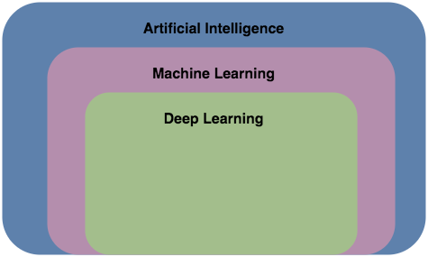

_The sub fields of artificial intelligence_

Modern computers are able to far outperform humans computationally, yet are not innately smart or intelligent. Artificial Intelligence is a field of study that seeks to create computers and algorithms that imitate the cognitive abilities of humans (Norvig, 2012). There are different means to achieving this goal and various subsets of artificial intelligence that aim to do this.
