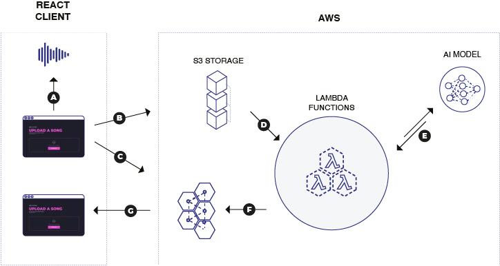

_The above diagram shows the overall system architecture for the final end-to-end appli- cation._

Amazon Web Services (AWS) was chosen as the Cloud Provider for the architecture of the project. Outsourcing the complexity involved in hosting and configuring the application in the cloud meant more time could be dedicated to ensuring a reliable end user experience and a more accurate, refined model.

AWS provides a variety of services that can be used to design a highly durable, scalable and reliable backend system to host the project, with a relatively low barrier to entry. The maturity of the services, and the robust APIs provided by AWS made this a good choice for my project.

AWS Lambda was used for the polyglot functions, which host the model and trigger the processing and prediction of the audio files. When a high volume of requests are routed to the Lambda functions, AWS will automatically manage the load by scaling up the number of instances of the function to handle thousands of requests concurrently (AWS, 2021c). This means that the system can seamlessly scale up or down to handle peaks and troughs in traffic, with no additional configuration or management.

Amazon MQ was used as a messaging queue throughout the system, to allow for a highly available, highly durable, asynchronous, loosely coupled architecture (AWS, 2021a). Amazon MQ stores messages across multiple Availability Zones (AZs) within a given AWS region, meaning that AWS will manage the replication of the messages as well as failure detection and recovery, again allowing for a robust, durable end user experience.
Finally, Amazon S3 buckets were used to store the audio files and serve the compiled React frontend. Amazon S3 is an object storage service which guarantees availability of the data, as well as handling security and performance concerns out of the box (AWS, 2021b).
