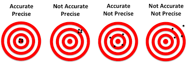

_The image above highlights the difference between accuracy and precision (Miessler, 2019)_

Metrics are an important key in understanding the performance of a model. It is necessary to cover this to gain an understanding of the metrics used to measure a neural network model and understand the literature review in the following section.

## Accuracy

The simplest approach is to take the percentage of correct predictions from the model (Ghoneim, 2019). This, however, poses problems in the case of imbalanced data.

## Precision

Precision is the measure of correctly predicted positive cases divided by the number of total positive cases (both true positives and false positives) (Ghoneim, 2019).

## Recall
The recall metric tells us the ratio of correctly predicted observations by the total number of positive cases (Ghoneim, 2019).

## F-Score
The F1 score is the weighted average of the precision and the recall (Ghoneim, 2019). The F1-score was the main metric of evaluation for the model.
