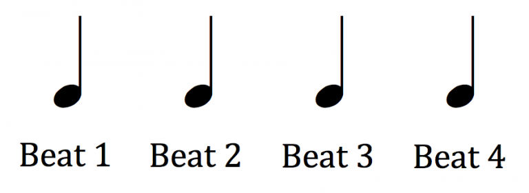
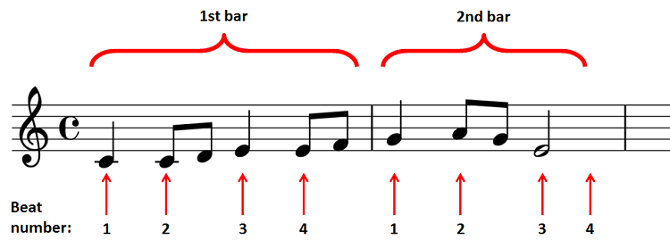

## Beats

_Shows quarter notes which are equal to 1 beat in 4 time (Matt, 2018)._

In music theory, a beat is a measure of time or pulse of a song or a recurring event. The number of beats in one minute gives us the tempo of a piece of music, also known as the beats per minute (BPM).

## Bars

_Shows the relationship between beats and bars in 4|4 time (Cohen, 2017)._

The even subdivisions of beats in a song are known as beats or measures. Typically in pop and electronic dance music, there are 4 beats in a bar, giving us what is known as 4|4 time. Another well known time signature is 3|4 time, used in the Waltz, and is made up of 3 beats per bar.

## Song Structure

_Shows the various song segments in a song (Yates, 2018)_

The building blocks of a song are known as the song sections. More commonly known songs sections are the chorus, verse and bridge of a song. These sections divide a song into logical divisions to tell a story.
