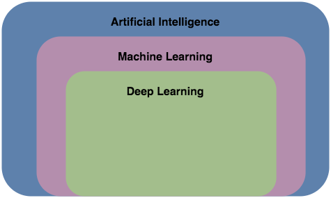
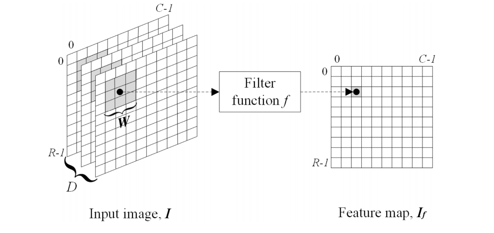

_The sub fields of artificial intelligence_

Modern computers are able to far outperform humans computationally, yet are not innately smart or intelligent. Artificial Intelligence is a field of study that seeks to create computers and algorithms that imitate the cognitive abilities of humans (Norvig, 2012). There are different means to achieving this goal and various subsets of artificial intelligence that aim to do this.

## Neural Networks

![Image of Deep Neural Network (IBM Cloud Education, 2020)][dnn]

_Image of Deep Neural Network (IBM Cloud Education, 2020)_

Neural networks are made up of an input layer, hidden layers and an output layer and are designed to be an artificial simulation of the neurons of the human brain. At every layer there are a series of interconnected artificial neurons called nodes, with their own weights and biases. Data is passed via the nodes through each layer of the network at a time and multiple passes of the data are used to train the neural network. Deep neural networks are simply neural networks with more than 3 hidden layers (IBM Cloud Education, 2020).

[dnn]: https://1.cms.s81c.com/sites/default/files/2021-01-06/ICLH_Diagram_Batch_01_03-DeepNeuralNetwork-WHITEBG.png "Image of Deep Neural Network (IBM Cloud Education, 2020)"

## Convolutional Neural Networks

_The use of a convolutional layer to obtain a feature map of input data (Valueva and Chervyakov, 2020)_

Convolutional neural networks are neural networks that make use of convolutional layers. Convolu- tional layers apply a filter to the input in order to obtain a feature map of the data. The convolutional layer can be considered as the layer that is responsible for the extraction of the features from the input data (Valueva and Chervyakov, 2020). In addition to the convolution layer, a convolutional network consists of a max pooling layer which is responsible for downsampling the feature maps and summarising the features (Brownlee, 2019).
