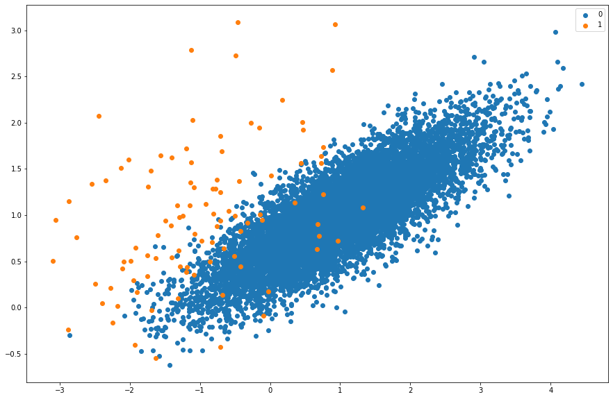
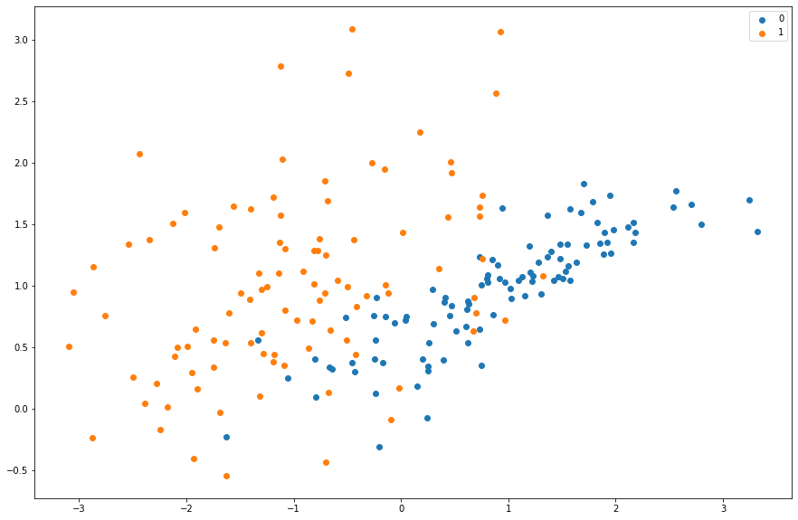
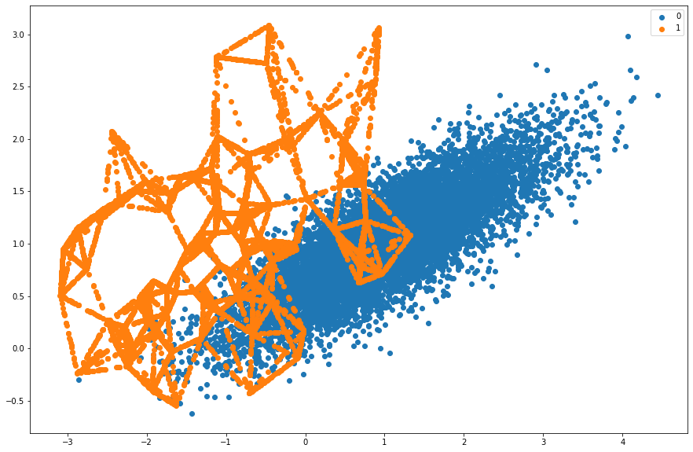

_A scatter plot of a class imbalance for a binary classification problem_

Imbalanced data can make training a neural network more challenging, especially in the cases of extreme imbalances. A common example of data imbalances can be found in fraud detection, where often 98% of the overall cases are negative, while only 2% are positive. In this example, a naive model could be developed which predicts a negative case 100% of the time, never labelling a transaction as fraudulent. The accuracy of this model would still be 98%. This is neither helpful nor desirable since the model would simply incorrectly predict or completely miss fraudulent transactions, defeating the aims of the predictive model.
Similarly, using audio data as an example, an audio clip of 30 seconds sampled at 22Khz has 661,500 samples. Converting the sampled audio to a Mel spectrogram results in 1300 frames for a frame size of 512. Assuming there are only 3 crossover points in the 30 second clip, the ratio of non-boundary points would be 3:1300. As per the section discussing accuracy, a naive model could be written that predicts no for every frame and still be right 99.74% of the time.

## Mitigation Techniques

### Oversampling

_A scatter plot of a class imbalance after random oversampling (The orange dots are more intense than before)_

One common technique used to mitigate imbalanced data is oversampling and undersampling. Over- sampling is achieved by taking a minority observation and making duplicates to increase the number of total minority observations and decrease the class imbalance (Brownlee, 2020a). It is not very clear in figure 19, however the intensity of the minority class, the orange dots, is a lot stronger and many of the data points have been multiplied.

### Undersampling

_A scatter plot of a class imbalance after random undersampling_

Undersampling takes the number of negative observations and removes a subset at random, so as to reduce the total number of negative observations and decrease the overall class imbalance (Brownlee, 2020a). Figure 20 shows how many of the majority points have been removed.

### SMOTE

_A scatter plot of a class imbalance after SMOTE oversampling_

A method of oversampling. SMOTE (Synthetic Minority Oversampling Technique). Rather than duplicating samples, the SMOTE method synthesizes new positive samples. The method is effective since it creates new features that are plausible but are not direct replicas of the original data (Brownlee, 2020b). Figure 21 shows how the SMOTE algorithm synthesises new datapoints to oversample the data.

### Label Smearing

Another approach to compensate for the small number of positive examples is called label smearing. This approach was used in the training of the state-of-the-art model and involves taking a crossover point and giving it a higher weighting. The adjacent frames, within 10 seconds of the crossover point, were then set to true also, but given a lower weighting along a Gaussian curve (Ullrich, Schlu ̈ter and Grill, 2014).
