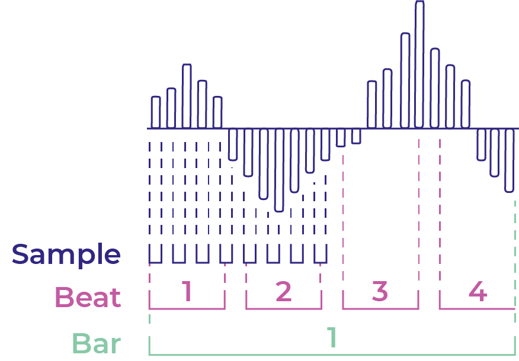

_Shows quarter notes which are equal to 1 beat in 4 time (Matt, 2018)._

Leveraging domain knowledge, the audio data was given additional structure to help train the model more efficiently. Aggregating the data into musical sub-divisions provided implicit rules in the data itself for when a crossover point could or could not occur. Figure 22 gives a high-level view of the size difference between samples, beats and bars.

## Samples

Returning to the previous example of a sampled piece of music. The number of data points, or samples, is calculated by multiplying the length of the audio by the sample rate. Theses samples are not intrinsically musical and the sample rate is normally chosen to satisfy the constraints of the Nyquist theorem.

## Beats

A musical boundary cannot occur on a measure of time that is not a musical sub division, typically the first beat of a bar. This revelation was based on a code implementation of the state-of-the-art model. The developer split aggregated the frames of the Mel spectrograms into beats, dubbing the result beat-wise Mel spectrograms (Leimeister, 2014). This finding was profound, since it elimi- nated the chance of feeding the neural network data points that could not logically be a musical boundary.

## Bars

During a discussion with my project supervisor, it was suggested to extend this discovery to the musical subdivision of bars. Since a transition of song sections, in a song in 4—4 timing, will not occur on a beat that is not the first beat of a bar.

## Consequences

An unintended consequence of this improvement also partially mitigated the imbalance data issue, since samples can be aggregated into musical bars, reducing the ratio between the majority and minority class observations. Figure 22 shows the difference in size between beats and samples.
Returning to the example from before, to try make an abstract concept more concrete. Assuming the tempo of the song was 120bpm and in 4 time, the 661,500 samples could be reduced to 15 bars. Supposing there are 3 boundaries in the audio clip, the ratio of boundaries to samples is 0.00045%. In comparison, there would be 3 boundaries in 15 bars, resulting in a ratio of 20%.
