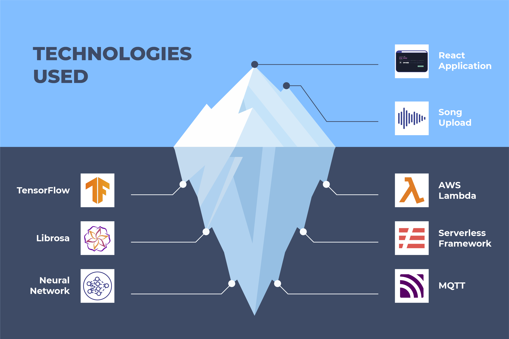

_The React web application is not the core part of the project, but a tool to showcase the model._

Given the requirements for the project, several technologies were considered for the implementation. The following section describes what technologies were chosen to build and deploy the final end- to-end product. Although it is only the tip of the iceberg, this section will start by discussing the front-end application.
