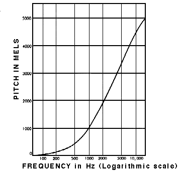

_Logarithmic nature of the Mel scale (Appleton and Perera, 1975)_

Humans do not perceive audio linearly. A 100Hz frequency difference at a low frequency range is perceived differently to a 100Hz frequency difference at a higher frequency range. The reason for this is that humans perceive frequencies logarithmically. To this end, a team of researchers, in 1937, proposed a unit of pitch known as the Mel. In the Mel scale, each note in the scale is perceived, to the listener, as equi-distant from the next (Roberts, 2020).
